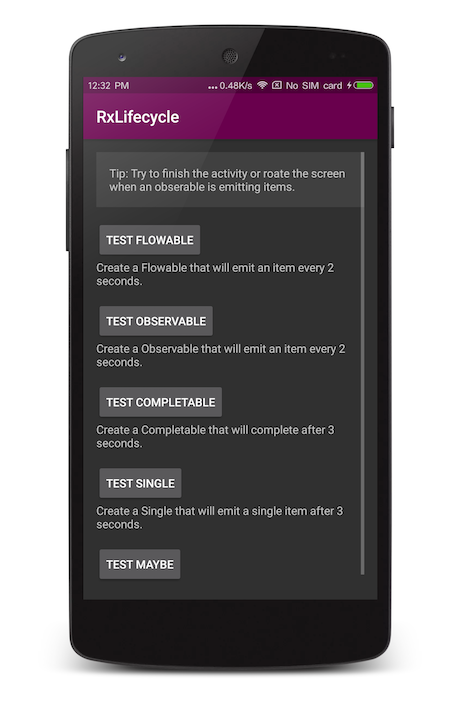

RxLifecyle is a library that can help you to unsubscribe the observable sequences automatically when a activity or fragment is destroying. There are some differences between this library and [trello/RxLifecycle](https://github.com/trello/RxLifecycle).

- This library will actually unsubscribe the sequence (See [here](https://github.com/trello/RxLifecycle#unsubscription)). It means that the downstream observer will not receive `onComplete()`, `onError()`... anymore when the unsubscription occurs.

- This library needn't you to inherit any activity or fragment. It will insert a non-gui fragment to your activity or fragment to listen the lifecycle events.

The simplest usage:

```java
Observable.interval(0, 2, TimeUnit.SECONDS)
        .compose(RxLifecycle.bind(MainActivity.this).<Long>disposeObservableWhen(LifecycleEvent.DESTROY_VIEW))
        .subscribe();
```

More usages can be found in the [sample](sample/src/main/java/cn/nekocode/rxlifecycle/example/MainActivity.java).



To integrate this library to your project, you need add the JitPack repository to `build.gradle` repositories firstly.

```gradle
repositories {
    maven { url "https://jitpack.io" }
}
```

And then add library dependencies:

```gradle
dependencies {
    compile 'com.github.nekocode.rxlifecycle:rxlifecycle:{lastest-version}'
    compile 'com.github.nekocode.rxlifecycle:rxlifecycle-compact:{lastest-version}' // Optional
}
```

This project is licensed under [Apache 2.0](http://www.apache.org/licenses/LICENSE-2.0.html). The lastest version of the library is [](https://jitpack.io/#nekocode/rxlifecycle).
